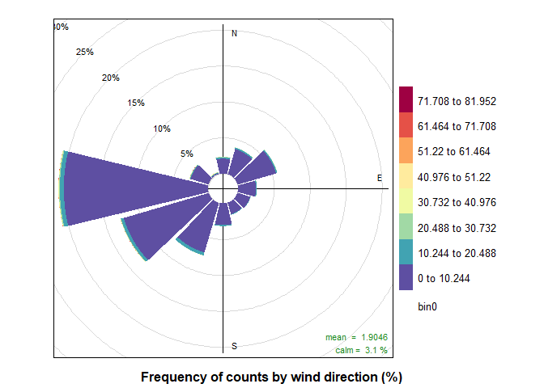
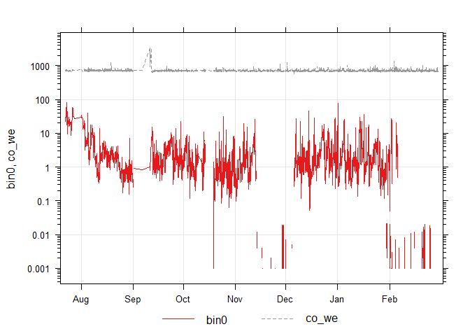
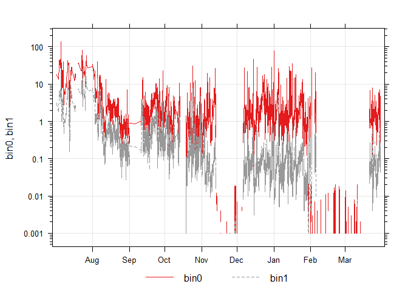

### Setup and Preprocessing

#### Including Necessary Libraries

``` r
library(dplyr)
```

    ## 
    ## Attaching package: 'dplyr'

    ## The following objects are masked from 'package:stats':
    ## 
    ##     filter, lag

    ## The following objects are masked from 'package:base':
    ## 
    ##     intersect, setdiff, setequal, union

``` r
library(ggplot2)
```

    ## Warning: package 'ggplot2' was built under R version 3.6.3

``` r
library(lubridate)
```

    ## Warning: package 'lubridate' was built under R version 3.6.3

    ## 
    ## Attaching package: 'lubridate'

    ## The following object is masked from 'package:base':
    ## 
    ##     date

``` r
library(scales)
library(gridExtra)
```

    ## 
    ## Attaching package: 'gridExtra'

    ## The following object is masked from 'package:dplyr':
    ## 
    ##     combine

``` r
library(grid)
library(openair)
```

#### Importing Data and Setting Up Workspace

``` r
#setting workspace
#setwd(choose.dir())
#next we import the data 
sn62 = read.csv("is2.csv", header = TRUE)

#this time I'm inporting data up until today as well
sn62_full = read.csv("IS_full.csv", header=TRUE)
```

#### Formatting

``` r
#changing the datetime format 
sn62$timestamp <- ymd_hms(sn62$timestamp)
#renaming the datasets, because openair needs a "date" column
#also setting wind_speed and wind_direction to ws and wd, b/c of wind rose function 
sn62 <- sn62 %>%
  rename(date = timestamp, ws = wind_speed, wd = wind_dir) 
#set the date column as the first column in the dataframe, for openair formatting
sn62[1] <- sn62$date
```

``` r
#doing the same for the full dataset
sn62_full$timestamp <- ymd_hms(sn62_full$timestamp)
sn62_full <- sn62_full %>%
  rename(date = timestamp, ws = wind_speed, wd = wind_dir) 
sn62_full[1] <- sn62_full$date
```

#### Filtering

``` r
sn62 <- dplyr::filter(sn62, between(sn62$wd, 0, 360))
sn62 <-dplyr::filter(sn62, between(sn62$ws, 0, 30))
sn62 <-dplyr::filter(sn62, between(sn62$pressure, 98000, 120000))
sn62 <- dplyr::filter(sn62, between(sn62$temp_manifold, -10, 40))
```

``` r
sn62_full <- dplyr::filter(sn62_full, between(sn62_full$wd, 0, 360))
sn62_full <-dplyr::filter(sn62_full, between(sn62_full$ws, 0, 30))
sn62_full <-dplyr::filter(sn62_full, between(sn62_full$pressure, 98000, 120000))
sn62_full <- dplyr::filter(sn62_full, between(sn62_full$temp_manifold, -10, 40))
```

Defining normal for the bin data
--------------------------------

Last week, I was looking at techniques to extrapolate average data for a
given time interval. After talking to Scott, this week I will try
approximating normal for the bin data by answering two questions:

1.  What are the general ranges of different bins?

2.  What are trends in ratios of small:large, small:medium particles?

##### Question 1: What are the general ranges?

I think I can answer this question with varying levels of precision.

First, we can just calculate what the min and max are for each bin.

``` r
apply(sn62[26:40],2,min)
```

    ##  bin0  bin1  bin2  bin3  bin4  bin5  bin6  bin7  bin8  bin9 bin10 bin11 bin12 
    ##     0     0     0     0     0     0     0     0     0     0     0     0     0 
    ## bin13 bin14 
    ##     0     0

``` r
apply(sn62[26:40],2,max)
```

    ##   bin0   bin1   bin2   bin3   bin4   bin5   bin6   bin7   bin8   bin9  bin10 
    ## 81.952 25.743 12.999 13.380  8.864 12.756  4.128  2.213  1.249  2.061  2.940 
    ##  bin11  bin12  bin13  bin14 
    ##  1.437  2.808  0.310  0.270

``` r
apply(sn62[26:40],2,mean)
```

    ##         bin0         bin1         bin2         bin3         bin4         bin5 
    ## 1.9046030485 0.2075601637 0.0933486966 0.0606446838 0.0451981228 0.0340030189 
    ##         bin6         bin7         bin8         bin9        bin10        bin11 
    ## 0.0115660918 0.0065294738 0.0041513607 0.0077725369 0.0041272141 0.0034275127 
    ##        bin12        bin13        bin14 
    ## 0.0057210675 0.0005371951 0.0002913324

Like before, I can calculate the seasonal and monthly averages. I
believe that in this cause, averages are better, because there is the
risk of outliers in this dataset.

``` r
## calculate monthly means
monthly <- timeAverage(sn62, avg.time = "month")
#calculating seasonal means
seasonaly <- timeAverage(sn62, avg.time = "quarter")
monthly_cleared <- subset(monthly, select=c(1,25:40))
monthly_cleared
```

    ## # A tibble: 8 x 17
    ##   date                   bin1    bin2    bin3    bin4    bin5    bin6    bin7
    ##   <dttm>                <dbl>   <dbl>   <dbl>   <dbl>   <dbl>   <dbl>   <dbl>
    ## 1 2019-07-01 00:00:00 8.06    4.01    2.29    2.16e+0 1.43e+0 0.542   2.90e-1
    ## 2 2019-08-01 00:00:00 0.638   0.282   0.151   1.40e-1 9.86e-2 0.0306  1.57e-2
    ## 3 2019-09-01 00:00:00 0.518   0.236   0.121   1.11e-1 1.27e-1 0.0399  2.18e-2
    ## 4 2019-10-01 00:00:00 0.315   0.149   0.0760  7.99e-2 9.04e-2 0.0339  2.25e-2
    ## 5 2019-11-01 00:00:00 0.0336  0.0126  0.0119  5.92e-3 3.72e-3 0.00124 7.99e-4
    ## 6 2019-12-01 00:00:00 0.0797  0.0339  0.0451  1.48e-2 4.28e-4 0       0.     
    ## 7 2020-01-01 00:00:00 0.0843  0.0313  0.0354  7.91e-3 9.56e-5 0       0.     
    ## 8 2020-02-01 00:00:00 0.00555 0.00148 0.00170 3.75e-4 1.50e-6 0       0.     
    ## # ... with 9 more variables: bin8 <dbl>, bin9 <dbl>, bin10 <dbl>, bin11 <dbl>,
    ## #   bin12 <dbl>, bin13 <dbl>, bin14 <dbl>, sample_time <dbl>, lat <dbl>

Wow, all the bin data from July is significantly higher than the rest of
the months. Let’s see what happens to the statistics when the July data
is taken out

``` r
noJuly <- selectByDate(sn62, month = c("January", "February","August", "September", "October", "November", "December"))
#apply(noJuly[26:40],2,min)
apply(noJuly[26:40],2,max)
```

    ##   bin0   bin1   bin2   bin3   bin4   bin5   bin6   bin7   bin8   bin9  bin10 
    ## 78.472 14.372  7.535 13.380  8.864  4.074  1.710  1.716  0.720  1.782  1.483 
    ##  bin11  bin12  bin13  bin14 
    ##  1.437  2.397  0.310  0.270

``` r
#apply(noJuly[26:40],2,mean)
```

These numbers are a lot lower. And, like in earlier deliverables, the
maximum for the bin data decreases and bin number increases

### Ratios

What are trends in ratios of small:large, small:medium particles? This
seems to be a two part analysis : First, I’ll have to create two
variables the represent the two ratios Then, I’ll determine the trends
by plotting the ratios

``` r
sn62$small_large_ratio <- sn62$bin0/sn62$bin14
sn62$small_medium_ratio <- sn62$bin0/sn62$bin7
```

``` r
#timePlot(sn62$small_medium_ratio)
#timePlot(sn62$small_large_ratio)
timePlot(sn62, pollutant= c("small_medium_ratio", "small_large_ratio"), log=TRUE)
```


They differ by some orders of magnitude. The ratio between small and
large data is about two magnitudes greater than small to medium.

Going back and Making Sense of Binned Data
------------------------------------------

Another goal I had for this week was to go back to plots like WindRose,
and PollutionRose - visualizations that show data in different bins- and
finally make them mean something. Up until now, the bins were different
sizes, and the top bin always seemed to be really huge. Because of this,
it was hard to say anything conclusive about the plots. Now, however, I
have figured out a way to make equally sized bins and can hopefully
finally make quality plots. Below I include all of the graphs that bin
data that I had tried to make in the past, this time, changing the bin
size.

#### WindRose

``` r
breaks1 = c(0,0.25*max(sn62$ws), 0.5*max(sn62$ws), 0.75*max(sn62$ws), max(sn62$ws))
windRose(sn62, breaks = breaks1)
```


``` r
windRose(sn62, type="month", breaks = breaks1)
```


``` r
windRose(sn62, type="weekday", breaks = breaks1)
```


It seems like lower speed winds are most common, and West and SouthWest
wind directions are most common. This doesn’t change for the days of the
week. This also doesn’t change for all the months, except July, when the
wind is strongest from the North East. This actually seems like its
correlated with the percentile rose data later on, and the mean bin0
data earlier on!!! The highest bin0 data was consistently in July, and
the direction that’s associated with the highest bin0 data is North
East. And this shows that the highest bin0 data is associated with
Northeast winds that happen in July.

#### PollutionRose

``` r
breaks2 = c(0,0.25*max(sn62$bin0), 0.5*max(sn62$bin0), 0.75*max(sn62$bin0), max(sn62$bin0))
breaks3 = c(0,(1/8)*max(sn62$bin0), (2/8)*max(sn62$bin0), (3/8)*max(sn62$bin0),
            (1/2)*max(sn62$bin0),(5/8)*max(sn62$bin0),(6/8)*max(sn62$bin0),
            (7/8)*max(sn62$bin0)
            )

breaks4 = c(0,(1/16)*max(sn62$bin0), (2/16)*max(sn62$bin0), (3/16)*max(sn62$bin0),
            (4/16)*max(sn62$bin0),(5/16)*max(sn62$bin0),(6/16)*max(sn62$bin0),
            (7/16)*max(sn62$bin0),
           (8/16)*max(sn62$bin0), (9/16)*max(sn62$bin0), (10/16)*max(sn62$bin0),
            (11/16)*max(sn62$bin0),(12/16)*max(sn62$bin0),(13/16)*max(sn62$bin0),
            (14/16)*max(sn62$bin0), (15/16)*max(sn62$bin0)
            )

pollutionRose(sn62, pollutant  = "bin0",breaks=breaks2)
```


``` r
pollutionRose(sn62, pollutant  = "bin0",breaks=breaks3)
```



``` r
pollutionRose(sn62, pollutant  = "bin0",breaks=breaks4)
```


``` r
pollutionRose(sn62, pollutant  = "bin0",breaks=breaks2, type = "weekday")
```


Oh, one interesting thing is that it has to include the whole dataset.
for example, if you make your last break go to 1/2, then that chunk will
be 1/2 to the max value.

!! Update: below, I tried to create a new dataset that only continued
smaller data, but after talking with Scott, I realize this is not a good
idea.

``` r
#new_df <- [sn62$wd[order(sn62$wd)], sn62$wd[order(sn62$wd)], sn62$bin0[order(sn62$bin0)]]

#test1<- sn62$wd[order(sn62$wd)]
#test1<- test1[1:.25*length(sn62$wd)]
#test1 <- test1 %>%
#  slice(1:.25*length(sn62$wd))
```

Otherwise, this is still not at the right bin size to analyze, so I will
not do any analysis yet.

#### PolarPlot

``` r
breaks2 = c(0,0.25*max(sn62$bin0), 0.5*max(sn62$bin0), 0.75*max(sn62$bin0), max(sn62$bin0))
polarPlot(sn62, pollutant = "bin0", k=80, breaks=breaks2,  smooth  =TRUE)
```


Breaks don’t work for PolarPlot, because there’s no binned data!

#### PercentileRose

``` r
percentileRose(sn62, pollutant = "bin0", smooth  =TRUE)
```


So, if I’m reading this correctly, most of the high value bin0 data is
coming from the North East. I’ll have to look into this more.

Correlations between binned data and CO (for aircraft activity)
---------------------------------------------------------------

``` r
timePlot(sn62, pollutant = c("bin0", "co_we"), group=TRUE)
```


``` r
timePlot(sn62, pollutant = c("bin0", "co_we"), group=TRUE, log=TRUE)
```


I tried graphing bin0 and co data, to see if there’s any correlation
between the two as a function of time. It doesn’t seem to be a good
approach, because the scales of the two are too different. Later, Scott
suggested that I could plot bin0 as a function of co, which I’ll do in a
later notebook.

``` r
corPlot(sn62)
```


This graph is too dense, so I’m only including variables that I think
could be important to analyze, and excluding the rest.

``` r
binandtemp <- sn62[,c(7,13:27)]
corPlot(binandtemp)
```


Above, I used corPlot, which makes a matrix of outputs of correlations
between the row and column variables. From this matrix, it doesn’t look
like there’s a strong correlation between CO and binned data.

#### Geographic analysis of bin data

I guess there’s no geographic equivalent to polarplot or something, so
you can’t really overlay the graph with a map. I guess I could just do
what Scott did and compare the map with the graph, side by side.

<!-- -->

(NOTE: I didn’t get to do the analysis of this, as I had hoped to, but I
will in later notebooks.)

Part 4: See what effect corona virus had on the data
----------------------------------------------------

``` r
timePlot(sn62_full, pollutant = c("bin0", "bin1"), group=TRUE, log=TRUE)
```



It doesn’t look like there’s a significant difference between bin data
pre-corona outbreak and post-corona outbreak.
