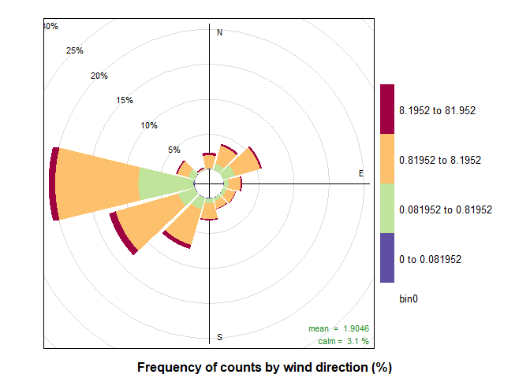
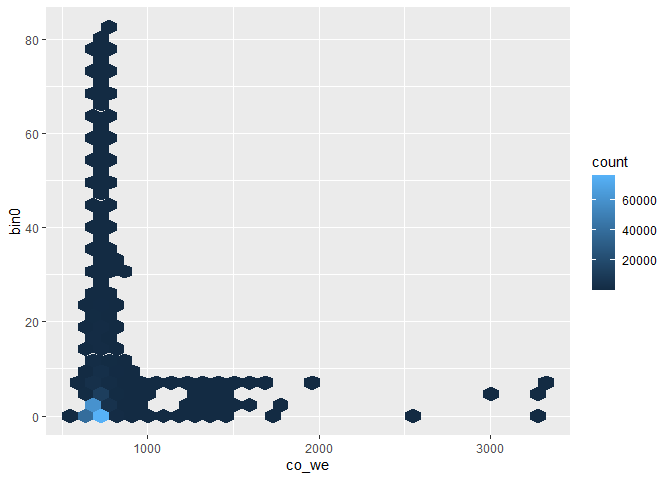

### Setup and Preprocessing

#### Including Necessary Libraries

``` r
library(dplyr)
```

    ## 
    ## Attaching package: 'dplyr'

    ## The following objects are masked from 'package:stats':
    ## 
    ##     filter, lag

    ## The following objects are masked from 'package:base':
    ## 
    ##     intersect, setdiff, setequal, union

``` r
library(ggplot2)
```

    ## Warning: package 'ggplot2' was built under R version 3.6.3

``` r
library(lubridate)
```

    ## Warning: package 'lubridate' was built under R version 3.6.3

    ## 
    ## Attaching package: 'lubridate'

    ## The following object is masked from 'package:base':
    ## 
    ##     date

``` r
library(scales)
library(gridExtra)
```

    ## 
    ## Attaching package: 'gridExtra'

    ## The following object is masked from 'package:dplyr':
    ## 
    ##     combine

``` r
library(grid)
library(openair)
library(data.table)
```

    ## Warning: package 'data.table' was built under R version 3.6.3

    ## 
    ## Attaching package: 'data.table'

    ## The following objects are masked from 'package:lubridate':
    ## 
    ##     hour, isoweek, mday, minute, month, quarter, second, wday, week,
    ##     yday, year

    ## The following objects are masked from 'package:dplyr':
    ## 
    ##     between, first, last

``` r
library(smps)
```

#### Importing Data and Setting Up Workspace

``` r
#setting workspace
#setwd(choose.dir())
#next we import the data 
sn62 = read.csv("is2.csv", header = TRUE)

#this time I'm inporting data up until today as well
sn62_full = read.csv("IS_full.csv", header=TRUE)
```

#### Formatting

``` r
#changing the datetime format 
sn62$timestamp <- ymd_hms(sn62$timestamp)
#renaming the datasets, because openair needs a "date" column
#also setting wind_speed and wind_direction to ws and wd, b/c of wind rose function 
sn62 <- sn62 %>%
  rename(date = timestamp, ws = wind_speed, wd = wind_dir) 
#set the date column as the first column in the dataframe, for openair formatting
sn62[1] <- sn62$date
```

``` r
#doing the same for the full dataset
sn62_full$timestamp <- ymd_hms(sn62_full$timestamp)
sn62_full <- sn62_full %>%
  rename(date = timestamp, ws = wind_speed, wd = wind_dir) 
sn62_full[1] <- sn62_full$date
```

#### Filtering

``` r
sn62 <- dplyr::filter(sn62, between(sn62$wd, 0, 360))
sn62 <-dplyr::filter(sn62, between(sn62$ws, 0, 30))
sn62 <-dplyr::filter(sn62, between(sn62$pressure, 98000, 120000))
sn62 <- dplyr::filter(sn62, between(sn62$temp_manifold, -10, 40))
```

``` r
sn62_full <- dplyr::filter(sn62_full, between(sn62_full$wd, 0, 360))
sn62_full <-dplyr::filter(sn62_full, between(sn62_full$ws, 0, 30))
sn62_full <-dplyr::filter(sn62_full, between(sn62_full$pressure, 98000, 120000))
sn62_full <- dplyr::filter(sn62_full, between(sn62_full$temp_manifold, -10, 40))
```

Spectrograms
============

First I got the smps library that Scott mentioned I had trouble
installing it at first, but I followed this advice (I had the exact same
error)
<a href="https://github.com/rstudio/distill/issues/47" class="uri">https://github.com/rstudio/distill/issues/47</a>

It looks like the data has to have time as its first column and then
some sort of bin number for all the rest of the columns, this could be
midpoint . or it should be diameter, so we can do midpoint like scott
said

so step 1 -\> make a new dataframe in the right format step 2-\> run
smps package

``` r
# put air data in the right format
# mydata <- subset(sn62, select=c(3,26:40))
# class(sn62[3]) 
# mydata <- mydata %>% mutate(date = ymd_hms(date)) #convert Time to a timestamp
# setnames(mydata, old =c('bin0','bin1','bin2','bin3','bin4','bin5','bin6','bin7','bin8','bin9','bin10','bin11','bin12','bin13', 'bin14'), new = c("0","1","2","3","4","5","6","7","8","9","10","11","12","13","14"))
# prepared_data <- prepare_data(mydata)
```

This isn’t working yet, but I’ll work on it next week !

Remaking PollutionRose
======================

``` r
breaks2 = c(0,(1/1000)*max(sn62$bin0),(1/100)*max(sn62$bin0), (1/10)*max(sn62$bin0), max(sn62$bin0))

pollutionRose(sn62, pollutant  = "bin0",breaks=breaks2)
```


I think that I finally like this pollutionRose plot. Although it still
has the bulk of the data in the \[1,9\] range, I can better see how much
that is to larger and smaller values.

Another thing, however, was that I was expecting high values from the
Northeast. Are they there, but I can’t see them? Are they just small,
comparatively to the other data?

I feel like I still don’t understand this plot well. Are the circles
representing what percentage of the data is facing that direction? So is
20% of the largest bin facing West?

Plotting Bin0 vs co\_we
=======================

This is a continuation of the work from Deliverable 5

``` r
ggplot(sn62,aes(x=co_we,y=bin0)) + geom_point(alpha = 0.01)
```


I tried getting a better sense of the data, by making a small alpha
value (ie , making the data points more transparent), however, it still
seems very dense.

``` r
ggplot(sn62,aes(x=co_we,y=bin0)) + stat_binhex()
```


I feel like this graph is more telling. It looks like the greatest
concentration of bin0 data points happens when bin0 values and co\_we
values are low. At about 500 (I’ve forgotten the unit, but I’ll check it
for next week!) co\_we units is the greatest number of data points, and
it spans all possible bin0 values. On the other hand, bin0 values seem
constant after 1000 co\_we units. I feel like there’s another part to
this graph that I need to know to make sense of this data. Is anything
after 1000 co\_we unreliable data? Is 500 co\_we units the most common
co concentration? Is it associated with planes?
