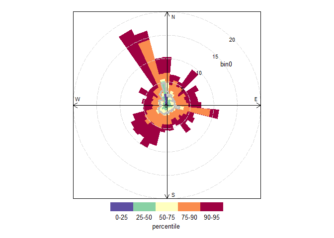
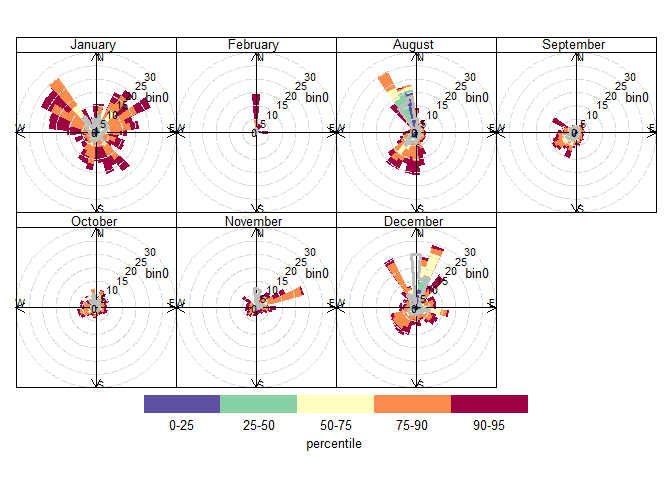
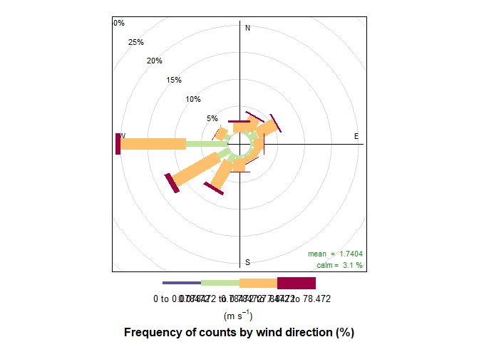
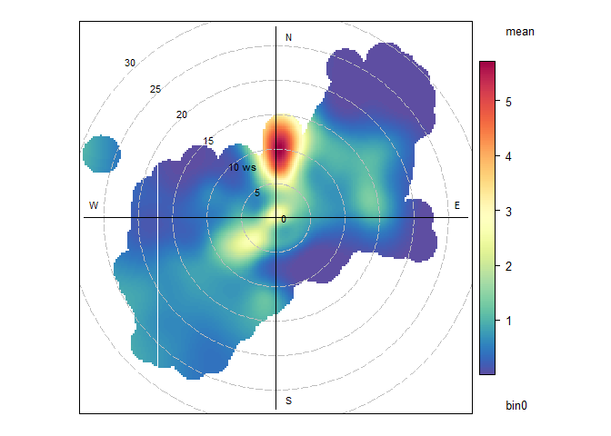
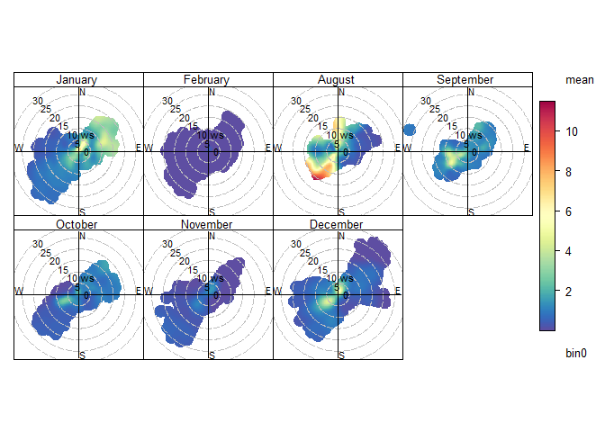

### Setup and Preprocessing

#### Including Necessary Libraries

``` r
library(dplyr)
```

    ## 
    ## Attaching package: 'dplyr'

    ## The following objects are masked from 'package:stats':
    ## 
    ##     filter, lag

    ## The following objects are masked from 'package:base':
    ## 
    ##     intersect, setdiff, setequal, union

``` r
library(ggplot2)
```

    ## Warning: package 'ggplot2' was built under R version 3.6.3

``` r
library(lubridate)
```

    ## Warning: package 'lubridate' was built under R version 3.6.3

    ## 
    ## Attaching package: 'lubridate'

    ## The following object is masked from 'package:base':
    ## 
    ##     date

``` r
library(scales)
library(gridExtra)
```

    ## 
    ## Attaching package: 'gridExtra'

    ## The following object is masked from 'package:dplyr':
    ## 
    ##     combine

``` r
library(grid)
library(openair)
library(data.table)
```

    ## Warning: package 'data.table' was built under R version 3.6.3

    ## 
    ## Attaching package: 'data.table'

    ## The following objects are masked from 'package:lubridate':
    ## 
    ##     hour, isoweek, mday, minute, month, quarter, second, wday, week,
    ##     yday, year

    ## The following objects are masked from 'package:dplyr':
    ## 
    ##     between, first, last

``` r
library(smps)
```

#### Importing Data and Setting Up Workspace

``` r
#setting workspace
#setwd(choose.dir())
#next we import the data 
sn62 = read.csv("is2.csv", header = TRUE)
```

#### Filtering and Reformatting

I finally added a separate R file that contains all the filtering and
reformatting code, so that it doesn’t clutter the notebooks.

``` r
source("generic_import.R")
sn62 <- generic_import(sn62)
```

    ## [1] "here"
    ## [1] "here"
    ## [1] "here"
    ## [1] "here"

Figuring out the July Abnormality
=================================

Based on our discussion last meeting, we decided that figuring out why
July is so abnormal consists of multiple “checks”. Below, I conduct
these checks and describe the output, in sections.

### Create Monthly Percentile Plots with and without July

First, I’ll create monthly percentile plots of the sn62 data. I suspect
that the plot for July will look different from the rest.

``` r
percentileRose(sn62, pollutant = "bin0", smooth  =TRUE, type="month")
```


Wow! This result’s really drastic ! July’s maximum bin values are about
seven times greater than the rest of the months. All of its bin values
are also associated with the west direction. Let’s see the
percentilerose again, but with July 4’s data taken out

``` r
sn62[sn62$date == as.Date("2019-07-04")] <- NA
```

``` r
percentileRose(sn62, pollutant = "bin0", smooth  =TRUE, type="month")
```


Actually, now that I look back at it, I don’t even have July 4th data in
the dataset! The data starts at 7/22. Therefore, you can’t take it out,
and it has no effect on the percentile plot.

### Time Series

Even if there’s no effect on the percentile plot, I’m going to plot the
time series, to see the data “up close”. After that, I’ll plot the
diurnal plot, to see daily trends (ie: if the values spike in the
evening).

``` r
sn62july <- selectByDate(sn62, month = "July")
ggplot(sn62july,aes(x=date,y=bin0)) + geom_point(alpha = 0.4)
```


Okay, so first of all, a lot of July’s data is missing. However, most of
the present data is high, higher than the maximum data for the other
months, based on the percentile plot above. This means that another
hypothesis on the July abnormality proved to be false: the high value
data isn’t concentrated to one date. However, there’s so few data
points, I don’t know if its reasonable to draw any definite conclusions.
Let’s try it though, and see what happens.

### Diurnal Profile

``` r
timeVariation(sn62july, pollutant = "bin0", ylab = "bin0")
```


I don’t know if this data is too sparse to draw conclusions, but it
doesn’t look like its definitely caused by grilling activity. While
there are spikes on Monday and Friday evenings (the latter of which I
suspected even more), on Wednesday and Thursday there are no evening
spikes. Furthermore, the greatest value comes from Tuesday, from the wee
hours of the morning. What’s more, all of this data is for just one week
- and that week is incomplete. Hm, I believe that for now, the July data
should be removed as an anomaly, and next July, when more data is
acquired, we can determine the source of the anomaly.

Representing Data
=================

plot percentile plot, polar plot, etc side by side; explore monthly
representations

To get an overview of the data, I’m going to plot percentile plot, polar
plot, and perhaps some others. Once generated, I’m going to create an
image, putting them side by side. I’m going to exclude the July data,
because I think it is unreliable.

``` r
sn62nojuly <- selectByDate(sn62, month = c("January", "February", "March", "August", "September", "October", "November", "December"))
```

``` r
percentileRose(sn62nojuly, pollutant = "bin0")
```



``` r
percentileRose(sn62nojuly, type="month", pollutant = "bin0")
```



``` r
percentileRose(sn62, type="month", pollutant="bin0")
```


Without the July plot, we see the other monthly plots a lot better. It
appears that they don’t really have a strong trend between them as to
wind direction. Except that you could say that they’re all northbound in
a way. This is something that’s expected, because we associate bin0 with
airport activity, which is North of the location.

``` r
breaks1 = c(0,(1/1000)*max(sn62$bin0),(1/100)*max(sn62$bin0), (1/10)*max(sn62$bin0), max(sn62$bin0))
breaks2 = c(0,(1/1000)*max(sn62nojuly$bin0),(1/100)*max(sn62nojuly$bin0), (1/10)*max(sn62nojuly$bin0), max(sn62nojuly$bin0))
windRose(sn62nojuly, pollutant = "bin0", breaks=breaks2)
```



``` r
windRose(sn62nojuly, type="month", pollutant = "bin0", breaks=breaks2)
```


``` r
windRose(sn62, type="month", pollutant="bin0", breaks = breaks1)
```


Here, we see that the winds that are associated with bin0 data don’t
look like the overall winds. This is evidence that bin0 particulates
come from the North.

``` r
polarPlot(sn62nojuly, pollutant = "bin0")
```



``` r
polarPlot(sn62nojuly, pollutant="bin0", type="month", smooth=70)
```



Here, it only seems like August, Decemeber and January have a Northern
component that has high bin0 values.

Comparing bin0 with pm1
=======================

Note that this is a work in progress!

Import the final data to extract pm1
------------------------------------

``` r
#setting workspace
#setwd(choose.dir())
sn62_final = read.csv("finaldata.csv", header = TRUE)
```

#### Formatting

``` r
#changing the datetime format 
sn62_final$timestamp <- ymd_hms(sn62_final$timestamp)
#renaming the datasets, because openair needs a "date" column
#also setting wind_speed and wind_direction to ws and wd, b/c of wind rose function 
sn62_final <- sn62_final %>%
  rename(date = timestamp, ws = wind_speed, wd = wind_dir) 
#set the date column as the first column in the dataframe, for openair formatting
sn62_final[1] <- sn62_final$date
```

#### Filtering for the same things as the usual sn62 data

``` r
sn62_final <- dplyr::filter(sn62_final, between(sn62_final$wd, 0, 360))
sn62_final <-dplyr::filter(sn62_final, between(sn62_final$ws, 0, 30))
sn62_final <-dplyr::filter(sn62_final, between(sn62_final$pressure, 98000, 120000))
sn62_final <- dplyr::filter(sn62_final, between(sn62_final$temp_manifold, -10, 40))
```

Plotting
--------

For some reason, the two datasets have been filtered to different
lengths. So, I can’t plot them on the same axis yet. I guess what’s more
important though is that I should also figure out why that is, since
those variables I thought didn’t change between final and raw.

Below, I have two separate plots of bin0 and pm1.

``` r
ggplot(sn62nojuly,aes(x=date,y=bin0)) + geom_point(alpha = 0.01)
```


``` r
ggplot(sn62_final,aes(x=date,y=pm1)) + geom_point(alpha = 0.01)
```

    ## Warning: Removed 5779 rows containing missing values (geom_point).


I wonder which 5779 rows were removed in the pm1 data plot, and why. In
the meantime, it looks these two plots correspond as to which times the
sensor was turned off, and they also have similar trends of increased
and decreased periods, but the magnitudes of those periods don’t align.
For example, both plots have a local maximum of data during August, but
pm1 data’s global maximum is during this time too, while bin0’s is not.
This could have to do with the fact that pm1 encompasses more bins than
just bin0.

Below is a plot of the two on the same axis, that doesn’t work yet.

``` r
# p <- ggplot(sn62nojuly, aes(x = date))
#   p <- p + geom_line(aes(y = bin0, colour = "Bin0"))
#   
#   # adding the relative humidity data, transformed to match roughly the range of the temperature
#   p <- p + geom_line(aes(y = sn62_final$pm1, colour = "PM1"))
#   
#   # now adding the secondary axis, following the example in the help file ?scale_y_continuous
#   # and, very important, reverting the above transformation
#   p <- p + scale_y_continuous(sec.axis = sec_axis(~.*5, name = "pm1"))
#   
#   # modifying colours and theme options
#   p <- p + scale_colour_manual(values = c("blue", "red"))
#   p <- p + labs(y = "bin0 ",
#                 x = "Date and time",
#                 colour = "Parameter")
#   p <- p + theme(legend.position = c(0.8, 0.9))
# p
```

Continue working on spectrograms
