Preparing notebook
------------------

``` r
library(dplyr)
library(ggplot2)
library(lubridate)
library(scales)
library(gridExtra)
library(grid)
library(openair)
library(data.table)
```

Running initial code, so that this file can create plots.

``` r
sn62 = read.csv("is2.csv", header = TRUE) #import data
sn62 <- sn62[,c("timestamp",setdiff(names(sn62),"timestamp"))]
sn62$timestamp <- ymd_hms(sn62$timestamp, tz="America/New_York") 
sn62 <- rename(sn62, ws = wind_speed, wd = wind_dir, date = timestamp) 
```

Insight 1
=========

Insight Statement
-----------------

The following values represent bounds for realistic meteorological data:

-Pressure : 90,000 &lt;x&lt; 120,000 Pa

-Temperature : -10 &lt;x&lt; 40 C

-Wind Speed : 0&lt;x&lt;30 m/s

-Wind direction : 0&lt;x&lt;360 degrees

Methods and Code
----------------

### Method

To come up with these values I looked at sources online for expected
highs and lows. Specifically,

### Code

In order to validate this data, I plotted these parameters before and
after filtering. Below is the code which I used to do so:

``` r
timePlot(sn62, pollutant="ws")
timePlot(sn62, pollutant="wd")
timePlot(sn62, pollutant="temp_manifold")
timePlot(sn62, pollutant="pressure")

sn62 <- dplyr::filter(sn62, between(sn62$wd, 0, 360))
sn62 <-dplyr::filter(sn62, between(sn62$ws, 0, 30))
sn62 <-dplyr::filter(sn62, between(sn62$pressure, 98000, 120000))
sn62 <- dplyr::filter(sn62, between(sn62$temp_manifold, -10, 40))

timePlot(sn62, pollutant="ws")
timePlot(sn62, pollutant="wd")
timePlot(sn62, pollutant="temp_manifold")
timePlot(sn62, pollutant="pressure")
```

Evidence
--------

Here is the output of the above code, positioned into two images of
before and after:

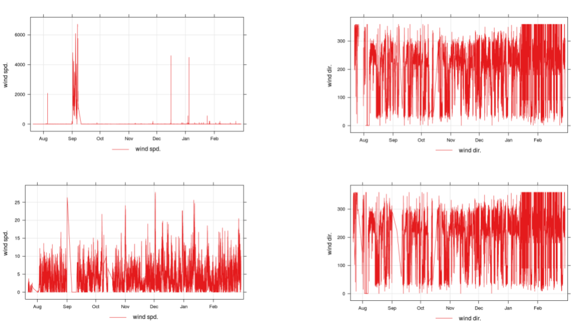 

Before the filtering, there were a lot of outliers. However, we see that
after filtering, the wind speed, pressure and temperature stay within
the limits of the bounds nicely. That is to say, they stay within the
bounds without any pattern of them “reaching” to go outside of the
bounds. This shows that that values outside of the bounds that I set are
one-instance outliers, validating the assumption that everything outside
of the bounds are anomalies of the instrument and not meteorological
trends. For wind direction, we can’t make the same statement, because it
represents a circle on a 2D axis, so it’s normal for 360 and 0 values to
occur. However, we can be most sure of the wind direction bounds,
because wind direction, by definition, only exists between 0 and 360
degrees.

Future Uses
-----------

In order to make sure that the data analyst isn’t drawing assumptions
from faulty data, I propose that they use the script which I’ve created
(generic\_import.R). This script does the necessary filtering and
formatting. By using this script, the data analyst will reduce the
chance they are looking at faulty data, and do it concisely, with three
lines of code:

``` r
sn62 = read.csv("is2.csv", header = TRUE) #import data
source("generic_import.R") #tell the R notebook to read functions from this file
sn62 <- generic_import(sn62) #run the filtering and formatting function
```

    ## Date in ISO8601 format; converting timezone from UTC to "America/New_York".

------------------------------------------------------------------------

Insight 2
=========

Insight Statement
-----------------

There are currently abnormalities in the dataset which skew information
about overall trends. So far, for site 62, January 1st data is
abnormally high due to New Year celebrations. Also, the data for July is
high and non-periodic, possibly due to sensor just being set up.

Methods and Code
----------------

### Method

At first, I tried making different plots and looking for trends. I found
that, if you look at the data by month, July dominates the graph so much
that you can only really see its data. That was definitely not normal,
so I plotted the monthly data without July, a timePlot of July’s data
and a diurnal plot of July’s data. I found that July had few data points
from the timePlot, and that there was no periodicity in it from the
diurnal plot. The rest of the months plotted without July were
distinguishable, and all in about the same range.

This also drew me to the conclusion that July’s data was too sparse and
erratic to be used as of now, even though I’m not certain about the
cause behind it. In order to seek out other abnormalities like this, I
began plotting timePlots of each month individually. Right of the bat, I
saw that January had a big spike on the first day, that was more than
twice the magnitude of any other day in that month. I made sure that
this spike occurred at midnight, and I believe that I can safely say
that it was the result of New Year’s celebrations.

### Code

#### Code that produces different plots by month

``` r
percentileRose(sn62, pollutant = "bin0", smooth  =TRUE, type="month") 
breaks1 = c(0,(1/1000)*max(sn62$bin0),(1/100)*max(sn62$bin0), (1/10)*max(sn62$bin0), max(sn62$bin0)) #preparing breaks for windrose plot
pollutionRose(sn62, pollutant = "bin0", type="month", breaks=breaks1)
```

#### Code that verified the abnormality of July

``` r
sn62july <- selectByDate(sn62, month = "July") #isolating july data

ggplot(sn62july,aes(x=date,y=bin0)) + geom_point(alpha = 0.4)#plotting bin0 in july as a function of time
timeVariation(sn62july, pollutant = "bin0", ylab = "bin0") #doing diurnal plot of July's bin 0 data

sn62nojuly <- selectByDate(sn62, month = c("January", "February", "March", "August", "September", "October", "November", "December")) #isolating dat from July 
percentileRose(sn62nojuly, type="month", pollutant = "bin0") #replotting graphs from before to solidify July's dominance
```

#### Code that shows the abnormality of January 1st

``` r
timePlot(selectByDate(sn62, month = "January"), pollutant = "bin0") #plotting time plot of bin0 for January 
timePlot(selectByDate(sn62, month = "January", day=c(1,2)), pollutant = "bin0") #plotting it for the first three days of January
timePlot(selectByDate(sn62, month = "December"), pollutant = "bin0") #showing trends from New Year's Eve too
```

Evidence
--------

-   This percentileRose plot illustrates my point of July’s data
    dominating:

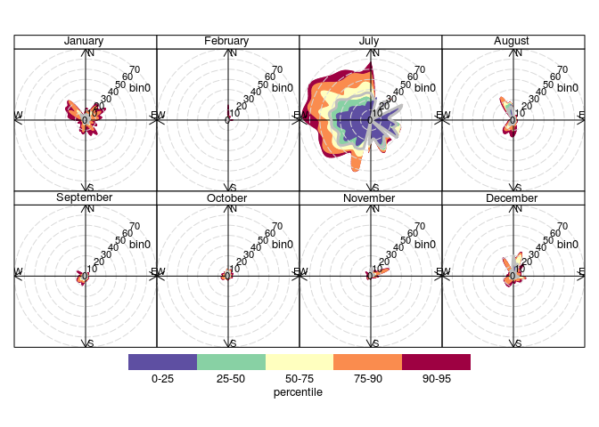

-   The timePlot of July that shows there’s few data points for the
    month of July:

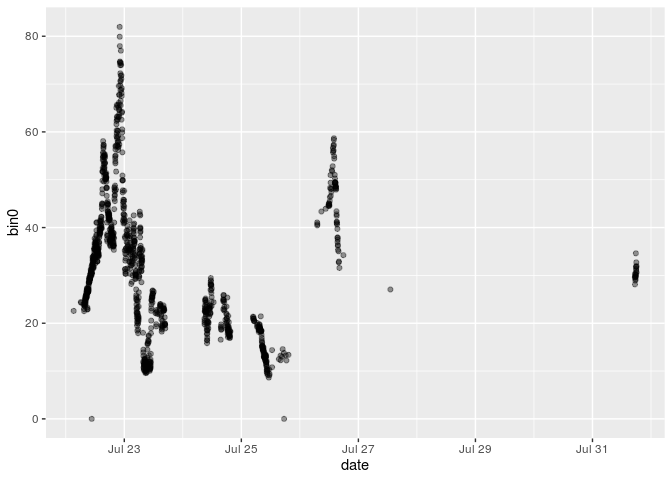
There’s not even five full days’ worth of data, out of 31 days of the
month.

-   This diurnal plot that shows there’s not a high periodicity in
    July’s data:

<!-- -->

    ## Warning in checkPrep(mydata, vars, "default", remove.calm = FALSE, strip.white =
    ## FALSE): Detected data with Daylight Saving Time, converting to UTC/GMT

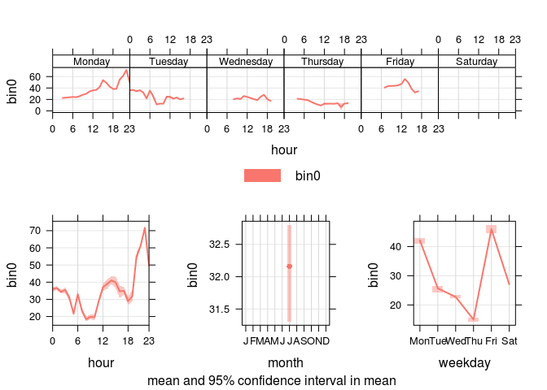

While there is a high spike at night in the plot of daily trends, we see
from the graph of weekly trends (above) that this is just from one
event. Similarly, the peak on Friday in the weekday plot (bottom right)
is compiled from only 12 hours of Friday data, total, which is not
enough to see a monthly trend.

-   Time plots which provide evidence of a big spike on January 1st:

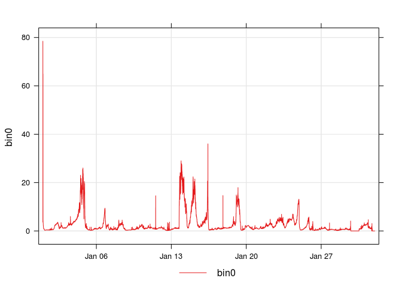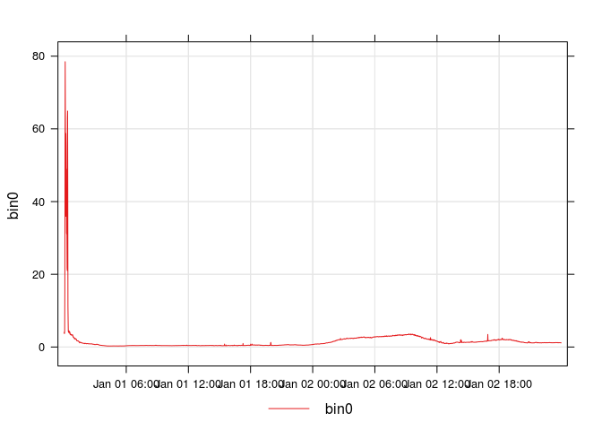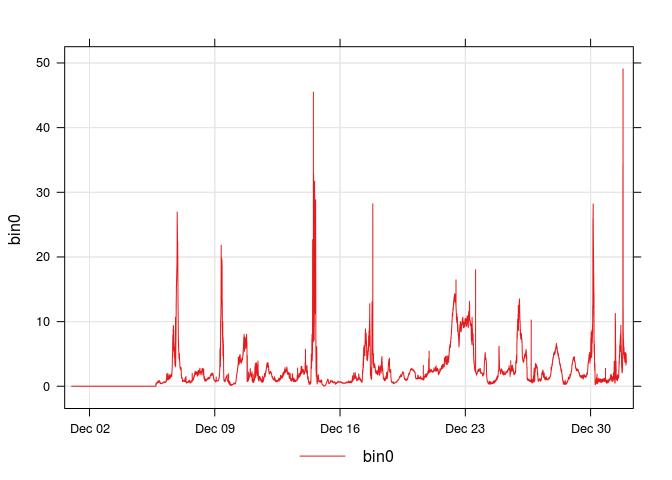

As you can see, the spike for January 1st is very high, and if we zoom
in, we see it happens on midnight of January 1st. If we look at December
data, we also see a spike on December 31st.

Future Uses
-----------

I think we should filter out antropogenic data like January 1st when we do analysis on the dataset as a whole, or as part of a bigger time series. 

Furthermore, when we start doing monthly types of analysis for the whole suite, we should do a summary of each sensor before anything else. This would include : number of data points, the mean, and the standard deviation- all for each month of the data for each sensor. 

------------------------------------------------------------------------

Insight 3
=========

Insight Statement
-----------------

Bin0 and PM1 data are associated with northern winds, which is not the
common wind direction for that location. PM2.5 data has high
concentrations to the North and East, which I believe is partially
caused by the anomaly in January (something I was not able to filter
yet). CO data seems like it needs to be analyzed more.

Methods and Code
----------------

### Method

For the bin0 data, I started plotting different openair plots, and
comparing them, as per Scott’s suggestion. Once I did this, it was just
a matter of drawing a conclusion.

Then, for this final deliverable, I just created extra functions which
would do the same for CO, PM1, and PM2.5. I plotted monthly data as well
when the output was not what I was expecting

### Code

Code to plot bin0 data

``` r
breaks2 = c(0,(1/1000)*max(sn62nojuly$bin0),(1/100)*max(sn62nojuly$bin0), (1/10)*max(sn62nojuly$bin0), max(sn62nojuly$bin0))
windRose(sn62nojuly, pollutant = "bin0", breaks=breaks2)

percentileRose(sn62nojuly, pollutant = "bin0")

polarPlot(sn62nojuly, pollutant = "bin0")
```

Code to import the dataset needed for PM1 and PM2.5 graphs

``` r
sn62_final = read.csv("finaldata.csv", header = TRUE)
sn62_final <- generic_import(sn62_final) #run the filtering and formatting function
sn62nojulyfinal <- selectByDate(sn62_final, month = c("January", "February", "March", "August", "September", "October", "November", "December"))  #removing July data
```

Code to plot the rest of the graphs

``` r
#co_we plots 

breaks2 = c(0,(1/4)*max(sn62nojuly$co_we),(2/4)*max(sn62nojuly$co_we), (3/4)*max(sn62nojuly$co_we), max(sn62nojuly$co_we))
windRose(sn62nojuly, pollutant = "co_we", breaks=breaks2)

percentileRose(sn62nojuly, pollutant = "co_we")

polarPlot(sn62nojuly, pollutant = "co_we")

percentileRose(sn62nojuly, pollutant = "co_we", type="month")

polarPlot(sn62nojuly, pollutant = "co_we", type="month")


# pm1 plots

windRose(sn62nojulyfinal, pollutant = "pm1") 

percentileRose(sn62nojulyfinal, pollutant = "pm1")

polarPlot(sn62nojulyfinal, pollutant = "pm1")

# pm2.5 plots 

windRose(sn62nojulyfinal, pollutant = "pm25")

percentileRose(sn62nojulyfinal, pollutant = "pm25")

polarPlot(sn62nojulyfinal, pollutant = "pm25")

percentileRose(sn62nojulyfinal, pollutant = "pm25", type="month")

polarPlot(sn62nojulyfinal, pollutant = "pm25", type="month")
```

Evidence
--------

-   Bin 0 plots:

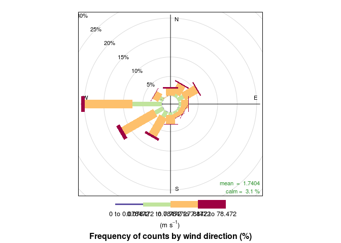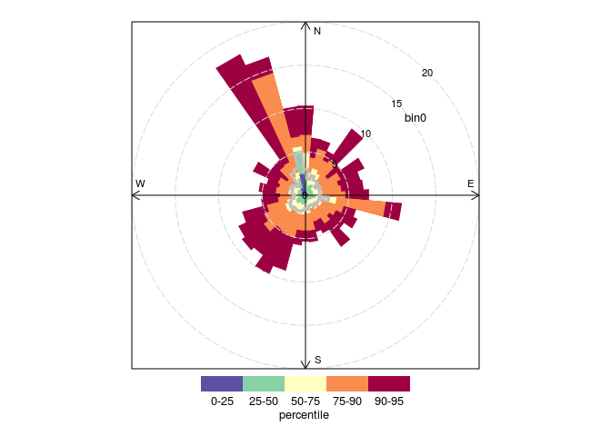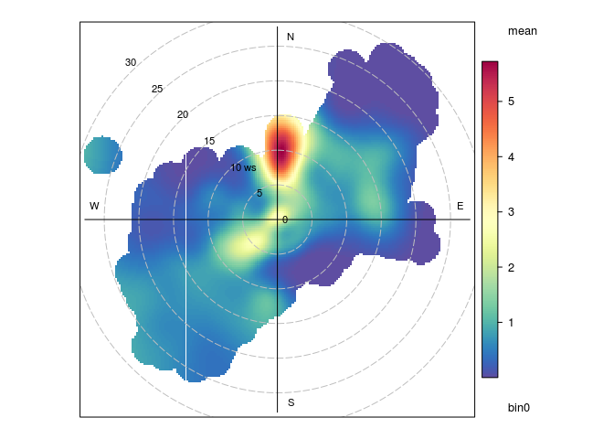
As you can see, wind direction points predominantly West, but both
polarPlot and percentilePlot show that the highest bin0 values
correspond to northern winds. This corresponds with what we were
expecting, because the airport is to the North and airplane plumes
contain high levels of PM1 (which bin0 represents).

-   PM 1 plots:

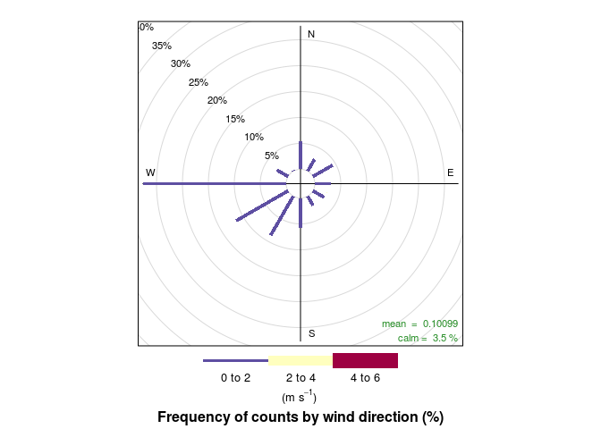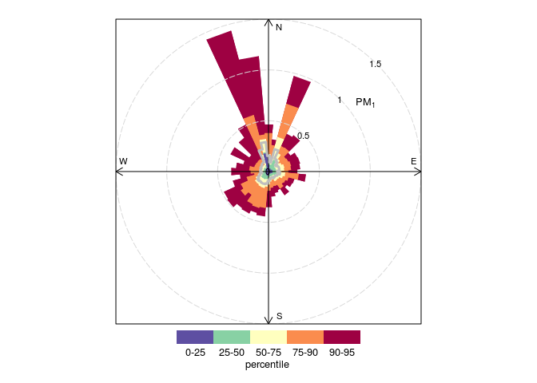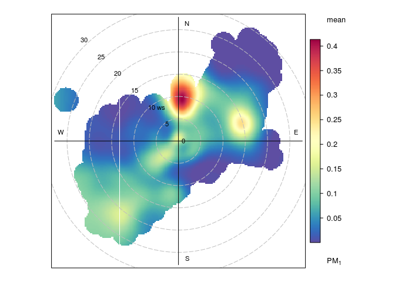

Bin0 is the “raw” data for PM1, and we see that the PM1 plots exhibit
the same trends as bin0. Note that that for the final data set used in
this plot, the windspeeds were already filtered to be at lower speeds.

-   PM 2.5 plots:

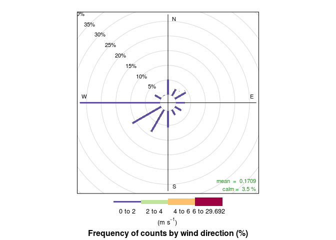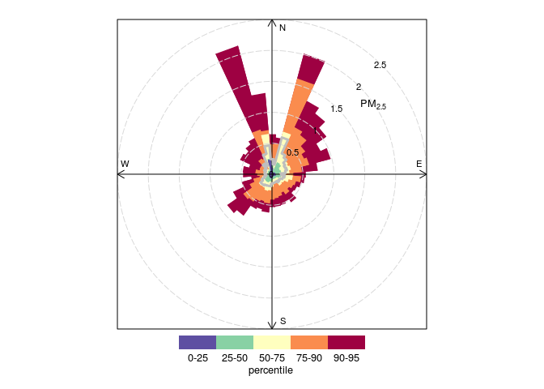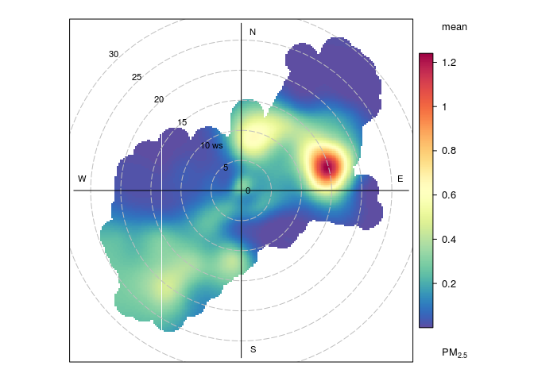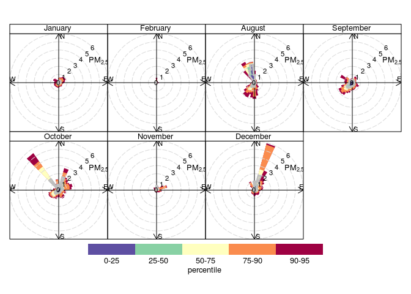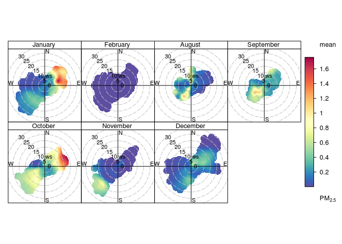

We see that there’s the same northern correlation, but also some
correlation to eastern winds as well. When we look at the monthly plots,
we see January and October exhibit strong correlation to eastern winds.
Because of this, I think that the January 1st data, which I wasn’t able
to extract, is perhaps influencing this result. I also think we should
also examine October’s data.

-   CO (working electrode) plots

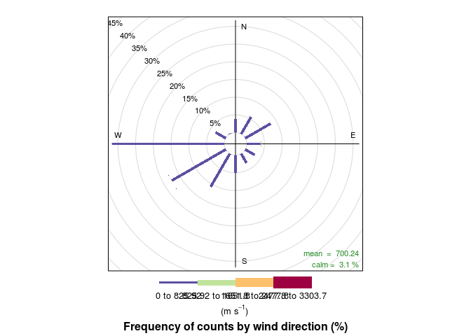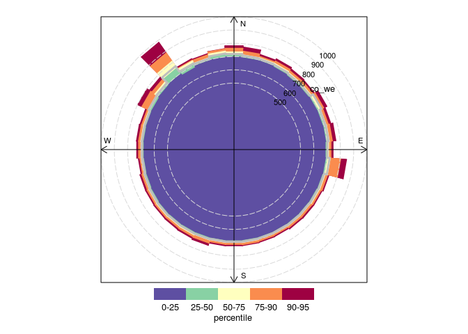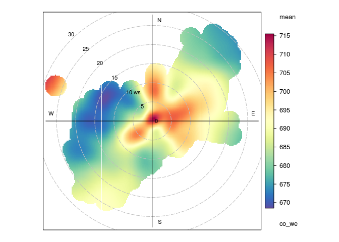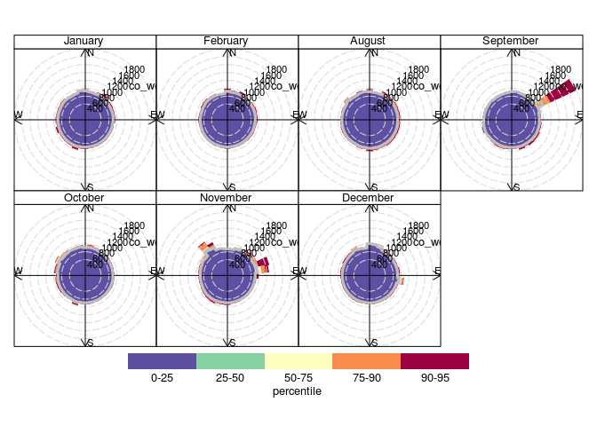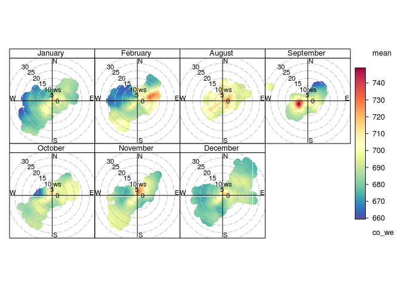

To be honest, I’m not sure why low co\_we values are so evenly
distributed in all directions. It also seems like where there are high
co concentrations differs by month. At the moment I don’t think I can
draw a conclusion from this.

update: it could be evenly distributed because the co data starts at around 300-400, but the plots always start at 0.

Future Uses
-----------

These bin0 and PM1 plots are useful because they point to some
correlation between activity to the North (the airport) and high PM1
concentrations.

However, more work needs to be done to understand the PM 2.5 and CO
plots.

update: Take this analysis with a grain of salt now, because the wind speed and wind direction data might not be accurate, which would change the graphs. 

------------------------------------------------------------------------

Insight 4
=========

Insight Statement
-----------------

I have created a reference document which highlights specific openair
functions that have been valuable to us this semester, what their
function is overall, and what each component of the output graph means.

Methods and Code
----------------

### Method

Sometimes i confused myself with the plots so I made a document where I
clearly state the relevant information about the plots. I started by
looking at the information from the manual, and then supplemented what
wasn’t there with online sources or deduction.

Evidence
--------

Find the document under the name aboutPlots.md in the Github. Use [this
link](https://github.com/scott-hersey/EB_AQ_Network/blob/master/Alli/aboutPlots.md)
to get there.

Future Uses
-----------

This could be a good reference to check a data analyst’s understanding
of the openair plots.

------------------------------------------------------------------------

Insight 5
=========

Insight Statement
-----------------

Our FAA subscription allows us to receive real-time data about KBOS
specific events and air travel across the U.S. and Canada, via command
line. I have created a document that explains what I know about FAA so
far, what I had done to access the data, and what the output was.

Methods and Code
----------------

I looked at the documents that Scott sent me, and supplemented what I
couldn’t find with information online.

Evidence
--------

I have created a markdown document, but I haven’t uploaded it anywhere,
because it could have potentially sensitive information.

Future Uses
-----------

If we’re going to make our own database with FAA data, this is some
basic information to familiarize oneself with the system.
