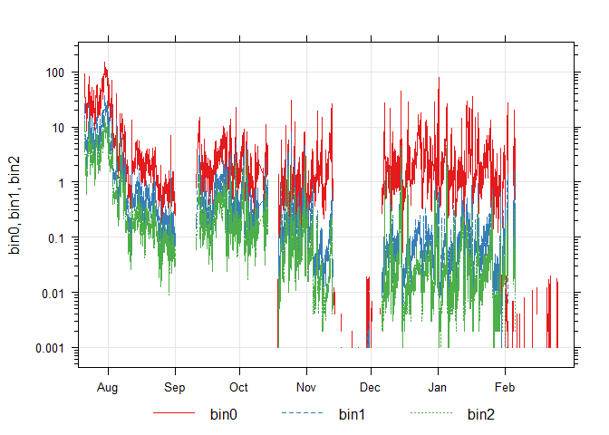
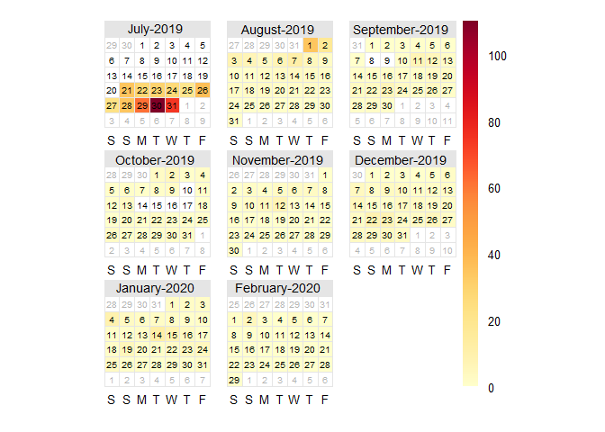
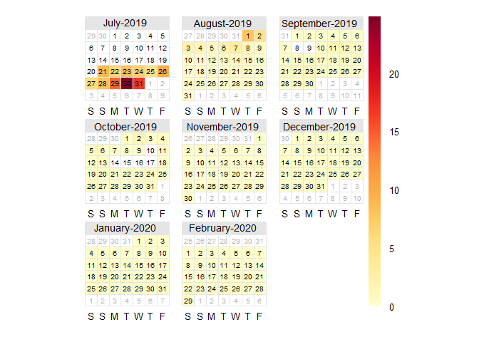
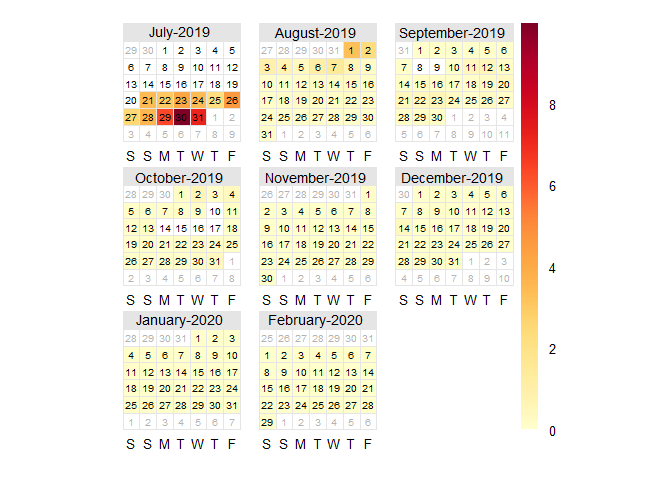
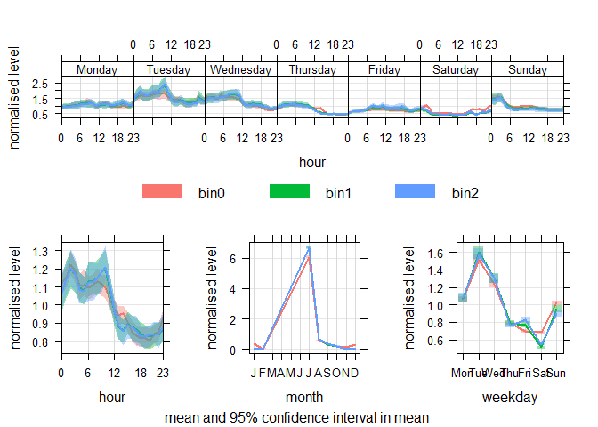

Overview
========

In this notebook, I do an initial observation of Aerodyne’s East Boston
air quality data, taken from newly developed sensors. Specifically, the
sensor I used in this R Notebook is SN 62.

The questions that I seek to answer are: “What does the data on the
finest particulate matter look like? Are there any overt trends over
time? Are there any blips in that data that are indicative of the
sensor’s performance?”

Because it is an initial observation, this notebook contains mainly
graph visualizations of the data, and my analysis of the apparent
trends. In future notebooks, I will explore the trends I found in this
notebook in greater detail, including statistical analysis.

The most important package I use in this analysis is R’s openair
package, which was specifically created to analysis air pollution data.
This package was recommended to me by my advisor Scott Hersey. \#
Preprocessing and Setup

### Including Necessary Libraries

``` r
library(dplyr)
```

    ## 
    ## Attaching package: 'dplyr'

    ## The following objects are masked from 'package:stats':
    ## 
    ##     filter, lag

    ## The following objects are masked from 'package:base':
    ## 
    ##     intersect, setdiff, setequal, union

``` r
library(ggplot2)
```

    ## Warning: package 'ggplot2' was built under R version 3.6.3

``` r
library(lubridate)
```

    ## Warning: package 'lubridate' was built under R version 3.6.3

    ## 
    ## Attaching package: 'lubridate'

    ## The following object is masked from 'package:base':
    ## 
    ##     date

``` r
library(scales)
library(gridExtra)
```

    ## 
    ## Attaching package: 'gridExtra'

    ## The following object is masked from 'package:dplyr':
    ## 
    ##     combine

``` r
library(grid)
library(openair)
```

### Importing Data and Setting Up Workspace

``` r
#setting workspace
#setwd(choose.dir())
#next we import the data 
sn62_janfeb = read.csv("is2.csv", header = TRUE)
```

### Formatting

``` r
#changing the datetime format 
sn62_janfeb$timestamp <- ymd_hms(sn62_janfeb$timestamp)
#renaming the datasets, because openair needs a "date" column
sn62_janfeb <- sn62_janfeb %>%
  rename(date = timestamp)
#set the date column as the first column in the dataframe, for openair formatting
sn62_janfeb[1] <- sn62_janfeb$date
```

Particulate Matter Travels Together
===================================

The raw particulate matter data from the sensor is given in “bins”. The
sensors have filters of different sizes that capture and count
particulate matter in certain size groups. The “bin” data that the
sensors provide are given in units of particles/second. This can be
converted to ug/m^3, however, for now I keep the data in the original
format. Below, I display the number of particles as a function of time
for the three smallest bins.

``` r
timePlot(sn62_janfeb, 
pollutant = c("bin0", "bin1", "bin2"),
group=TRUE,  log=TRUE)
```


One noticeable part of this graph is that the three data vectors change
the same way over time. This validates that the same factors are
contributing to the fluxuation of particulate matter.

We also see that the bin0 data is about 10 times greater in magnitude
than the other two bins. When we take into consideration that
particulate matter becomes more dangerous the smaller it is, this could
potentially be an alarming point, and something that we should explore
further.

The last major point of this data is that it’s incomplete! Starting at
Feb 3, bin1 and bin2 data almost completely stop, and bin0 data shows up
once in a while on nonconsecutive days. What happened to this data? Is
this a product of human manipulation of the sensors, a misleading
representation or a malfunction in the sensors themselves?

It’s Harder to Breathe on Some Days
===================================

In the first figure, we saw that the three particulate bins fluxuate
together. However, we also can see based the sharp spikes in the figure
that the number of particles that are entering the bins can change
drastically, in a short time frame. In order to explore this even
further, we can create heatmaps of each individual bin’s data.

``` r
calendarPlot(sn62_janfeb, pollutant = "bin0")
```



``` r
calendarPlot(sn62_janfeb, pollutant = "bin1")
```



``` r
calendarPlot(sn62_janfeb, pollutant = "bin2")
```



Indeed, we continue to see spikes in the heatmap data. In all the data,
we see a spike on Saturday, January 4th. This could possibly be
connected to travelling after New Year’s. There’s also a local maximum
of particulate matter on Sunday January 19th, the day before Martin
Luther King Jr. Day. Perhaps this event as well could be the product of
greater travelling. We also see heightened activity on January 14th for
bins 0 and 1. I looked at Boston’s events calendar for this day, but
could not find a major event. Thus, the event that caused this result
must be something that is not holiday-related. The same can be true for
January 25th and 26th, in which there is heightened bin 1 and bin 2
activity.

In general, we see that there is considerably less activity in February
than in January. An interesting point to study more in the future is the
difference in activity during holiday season versus non-holiday season.

Daily and Weekly Trends
=======================

In the last section, I speculated that there is increased particulate
matter around holidays. In this section, I explore if there are
consistent weekly or daily trends. I use OpenAir’s timeVariation
function, which generates plots of the pollutants on different
timescales.

``` r
timeVariation(sn62_janfeb, pollutant = c("bin0", "bin1", "bin2"), normalise = TRUE)
```


Note: this graph is best seen in R, instead of HTML, and maximized to
full screen.

The weekly graph shows us that there is a peak starting during Saturday
night going into Sunday morning. More data on social trends is needed to
explain this peak, however, I assume it is caused by increased nightlife
in the city.

Additionally, Tuesday and Wednesday have the greatest amount of
particulate matter during the early hours of the morning, 12am to 6am. I
was expecting the greatest peaks to be during rush hours, because of
vehicular traffic. Again, additional data is needed to draw a
conclusion.

The daily graph resembles a cosine graph, with an offset trough. Like
the weekly graph, I was expecting increased particulate matter at 6pm, a
time when a lot of cars are on the road.

Finally, once more sensor data is acquired, we can comment on yearly
trends. For now, this data is inconclusive.

Next Steps
==========

For the next week, I will analyze the meteorological data that this
sensor offers. Specifically, I will graph meteorological trends
overlayed with particulate matter trends, to deduce cause-and-effect. I
will also incorporate data from other sensors, to start telling the
story of East Boston air quality from a spatial, as well as
spatial-temporal, perspective.
