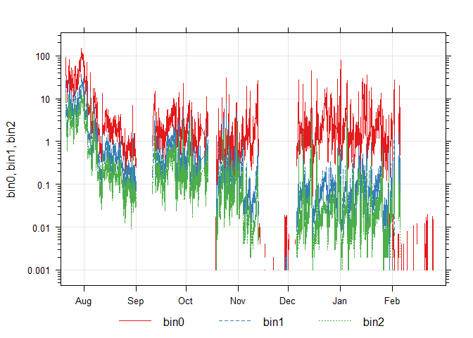
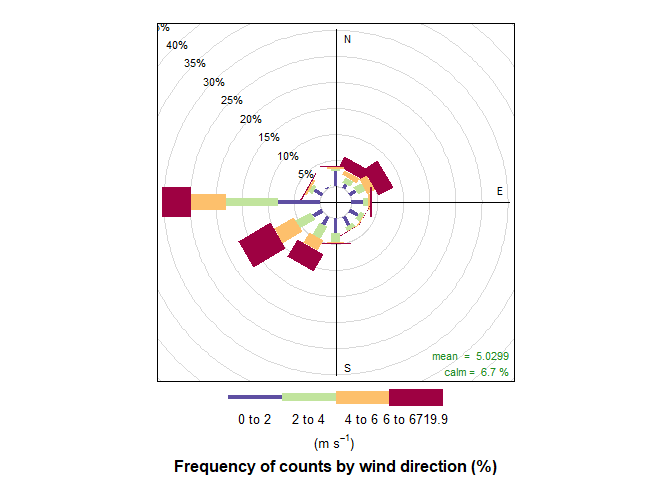
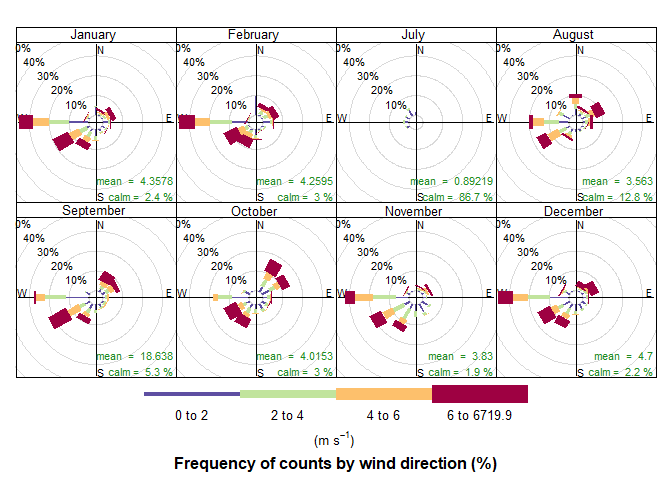
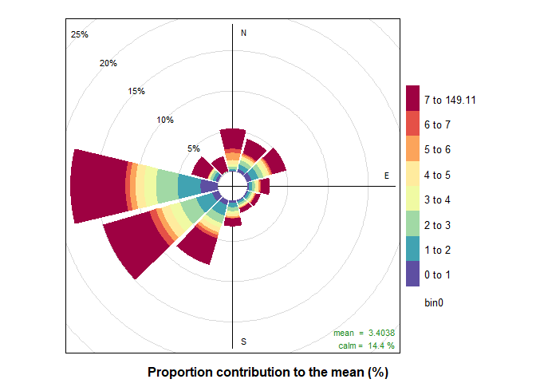
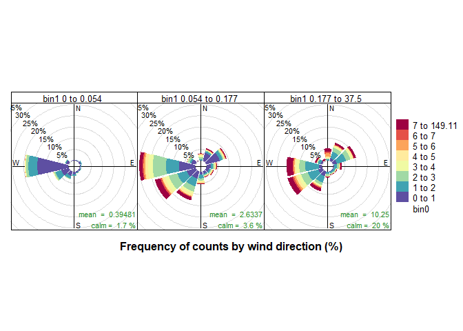
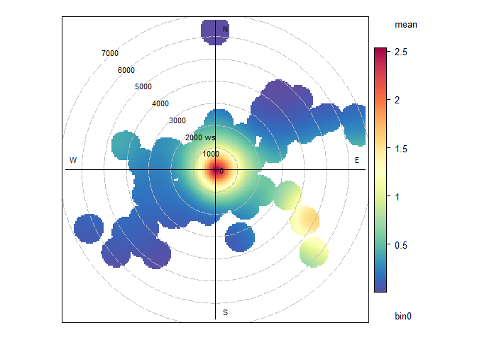
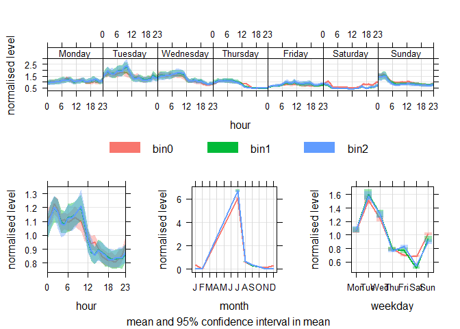
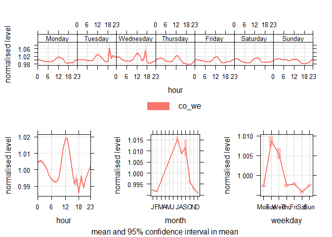

Preprocessing and Setup
=======================

### Including Necessary Libraries

``` r
library(dplyr)
```

    ## 
    ## Attaching package: 'dplyr'

    ## The following objects are masked from 'package:stats':
    ## 
    ##     filter, lag

    ## The following objects are masked from 'package:base':
    ## 
    ##     intersect, setdiff, setequal, union

``` r
library(ggplot2)
```

    ## Warning: package 'ggplot2' was built under R version 3.6.3

``` r
library(lubridate)
```

    ## Warning: package 'lubridate' was built under R version 3.6.3

    ## 
    ## Attaching package: 'lubridate'

    ## The following object is masked from 'package:base':
    ## 
    ##     date

``` r
library(scales)
library(gridExtra)
```

    ## 
    ## Attaching package: 'gridExtra'

    ## The following object is masked from 'package:dplyr':
    ## 
    ##     combine

``` r
library(grid)
library(openair)
```

### Importing Data and Setting Up Workspace

``` r
#setting workspace
#setwd(choose.dir())
#next we import the data 
sn62 = read.csv("is2.csv", header = TRUE)
```

### Formatting

``` r
#changing the datetime format 
sn62$timestamp <- ymd_hms(sn62$timestamp)
#renaming the datasets, because openair needs a "date" column
#also setting wind_speed and wind_direction to ws and wd, b/c of wind rose function 
sn62 <- sn62 %>%
  rename(date = timestamp, ws = wind_speed, wd = wind_dir) 
#set the date column as the first column in the dataframe, for openair formatting
sn62[1] <- sn62$date
```

Analysis of Time Series Data
============================

``` r
timePlot(sn62, 
pollutant = c("bin0", "bin1", "bin2"),
group=TRUE,  log=TRUE)
```


I graphed this plot last week, and I plotted it again this week, but for
a larger interval. With this larger set of data, we see that there are
four gaps in measurements. We also see that bin0 will sporadically take
data in these mute intervals. This is an anomaly that we should look
into. It also seems like the particle count of the three bins was fairly
similar when the sensors were deployed, but starting in November, the
particle count of bin0 became almost ten times greater than the other
two. Another way to look at this is that all three bins’ counts were
decreasing directly since the sensor deployment until September (before
the first gap). During September and October, the particle count of the
three bins is fairly consistent. It looks like starting November 1st,
the particle count decreased five fold and the particle count of bin0
increased five fold. After that, the particle counts remain fairly
consistent again.

### Calculations

### Dutycycle

``` r
# Calculate what percentage of the total entries for the bin data is not zero
nonzero_bin0 <- length(which(sn62$bin0 != 0))
total_bin0 <- length(sn62$bin0)
dutycycle_bin0 <- nonzero_bin0/total_bin0

nonzero_bin1 <- length(which(sn62$bin1 != 0))
total_bin1 <- length(sn62$bin1)
dutycycle_bin1 <- nonzero_bin1/total_bin1

nonzero_bin2 <- length(which(sn62$bin2 != 0))
total_bin2 <- length(sn62$bin2)
dutycycle_bin2 <- nonzero_bin2/total_bin2
```

Using this simple analysis, I approximate the duty cycle of the three
smallest bins of the sensor to be 69%.

Meteorology & Seasonality
=========================

WindRose
--------

``` r
windRose(sn62)
```

    ## Warning in checkPrep(mydata, vars, type, remove.calm = FALSE, remove.neg =
    ## rm.neg): Wind speed <0; removing negative data

    ## Warning in checkPrep(mydata, vars, type, remove.calm = FALSE, remove.neg =
    ## rm.neg): Wind direction < 0 or > 360; removing these data



``` r
windRose(sn62, type="month")
```

    ## Warning in checkPrep(mydata, vars, type, remove.calm = FALSE, remove.neg =
    ## rm.neg): Wind speed <0; removing negative data

    ## Warning in checkPrep(mydata, vars, type, remove.calm = FALSE, remove.neg =
    ## rm.neg): Wind direction < 0 or > 360; removing these data


Interesting! Most of the time, the wind is directed West of SouthWest.
And July seems to have barely any data, but that month’s data is
incomplete. March, April, May and June aren’t included as well, because
there is no data for those months.

Most months that are included have a mean windspeed of somewhere between
3.5 m/s and 4.7 m/s. The two exceptions are July, which has really low
speeds, and September which has really high speeds (19 m/s). It looks
like winds were more common in winter months (Dec, Jan and Feb) than
other months. However, more data is needed to make a claim about that.
It’s windy all of the time, it seems like. Calm, the percentage of time
with wind speed = 0, is less than 3% all of the winter months. In July,
however, it is calm almost all of the time, at 86.7%. This will be good
to keep in mind when looking at changes in amount of particulates in the
air.

Just to have as a reference: -the paddle wideness denotes windspeed ,
also color in this case denotes windspeed -the degrees on the graph
denote wind direction -the grey circles are showing the frequency of
counts by wind direction -calm is the percentage of time that the wind
speed is zero

what would the data look like if less speedy wind was more common? maybe
its cumulative in the openair manual, the last interval is also the
largest, why is that? ie significantly larger

PollutionRose
-------------

``` r
pollutionRose(sn62, pollutant = "bin0", statistic = "prop.mean")
```

    ## Warning in checkPrep(mydata, vars, type, remove.calm = FALSE, remove.neg =
    ## rm.neg): Wind speed <0; removing negative data

    ## Warning in checkPrep(mydata, vars, type, remove.calm = FALSE, remove.neg =
    ## rm.neg): Wind direction < 0 or > 360; removing these data



``` r
pollutionRose(sn62, pollutant  = "bin0", type="bin1")
```

    ## Warning in checkPrep(mydata, vars, type, remove.calm = FALSE, remove.neg =
    ## rm.neg): Wind speed <0; removing negative data

    ## Warning in checkPrep(mydata, vars, type, remove.calm = FALSE, remove.neg =
    ## rm.neg): Wind direction < 0 or > 360; removing these data


Openair makes drastically different sized bins. I wonder if it just
splits number of occurences equally?

Also, for making sense of this data, let’s look at the first plot - the
bin0 mean plot. The bin0 mean plot: So, the degrees on the plot show the
direction of the wind. The size of the wedge shows windspeed and the
color shows bin0 particle count? I guess it makes sense that greater
wind speed causes the particulates to move more into the sensor.
However, I’d still like to see a case for which this isn’t true. I’m
also not sure now if the “mean” annotation refers to the mean wind speed
or the mean particle count. Actually, by looking at the graph, I’d
expect a higher mean particle count.

The second plot is a little hard to digest. It’s the same as the first
plot, except that its also grouped by bin1 data. So, when bin1 data is
low, bin0 data is low. In graph 1 we also see that when both particulate
sizes are small, there isn’t a lot of frequency counts, but the speed is
still high. For the second graph, we see the full span of all bin0
particulate counts. However, We also see its more common to have the
mid-range of bin0 particulate counts. In this graph, the wind is more
directed to the West and south west, and the wind speed is higher. In
the third graph, the wind direction is more evenly spread out between
SouthWest and NorthEast. There is a greater ratio of higher bin0
particulate counts.

All three graphs seem to show that the particulate bin counts increase
directly. It looks like the weather is calmer, the higher the bin count
is, but perhaps this is an anomaly caused by lack of data.

Questions:

-   for graph 1, it looks like way more than 20% of the frequency counts
    are coming from the west. It looks like the rest of the directions
    barely have any percentage- how can that add up to 80%? How can it
    be not calm but also not have a lot of wind blowing?

OH - I think this graph doesn’t show wind speed at all. The different
wedge lengths I think represent how much of each concentration is in
what direction.

“By supplying the option statistic =”prop.mean" (proportion contribution
to the mean), a good idea can be gained as to which wind directions
contribute most to overall concentrations, as well as providing
information on the different concentration levels."

“For many, maybe most situations, increasing wind speed generally
results in lower concentrations due to increased dilution through
advection and increased mechanical turbulence.” “Buoyant plumes from
tall stacks can be brought down to ground-level resulting in high
concentrations under high wind speed conditions.”

PolarRose
---------

``` r
polarPlot(sn62, pollutant = "bin0", k=80)
```

    ## Warning in checkPrep(mydata, vars, type, remove.calm = FALSE): Wind speed <0;
    ## removing negative data

    ## Warning in checkPrep(mydata, vars, type, remove.calm = FALSE): Wind direction <
    ## 0 or > 360; removing these data


It appears that bin0 particle count decreases with increased wind speed.
This is not what I was expecting, based on the WindRose plots, and will
try to figure out if this is an issue in my understanding.

Diurnal Profiles
================

``` r
timeVariation(sn62, pollutant = c("bin0", "bin1", "bin2"), normalise = TRUE)
```



Like the timePlot, I also created this plot last week. The difference
here is that I’m including a greater range of data. The weekly diurnal
plot follows the same trend as the one from last week, if anything, the
trends from last week are amplified. I also think that the yearly data
is incomplete, and that we shouldn’t analyze it yet.

``` r
timeVariation(sn62, pollutant = c("co_we"), normalise = TRUE)
```



The most shocking thing about this to me is how smooth the hourly data
is. Like the previous data, there is a spike on Tuesday and Wednesday,
but, unlike the bin data, there isn’t a spike on Saturday night.
